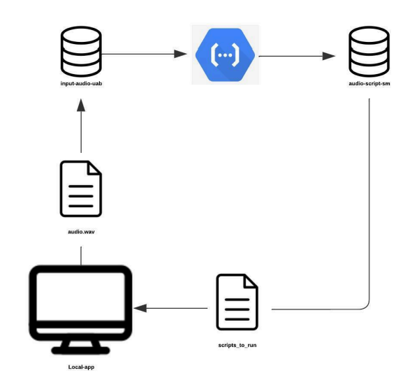
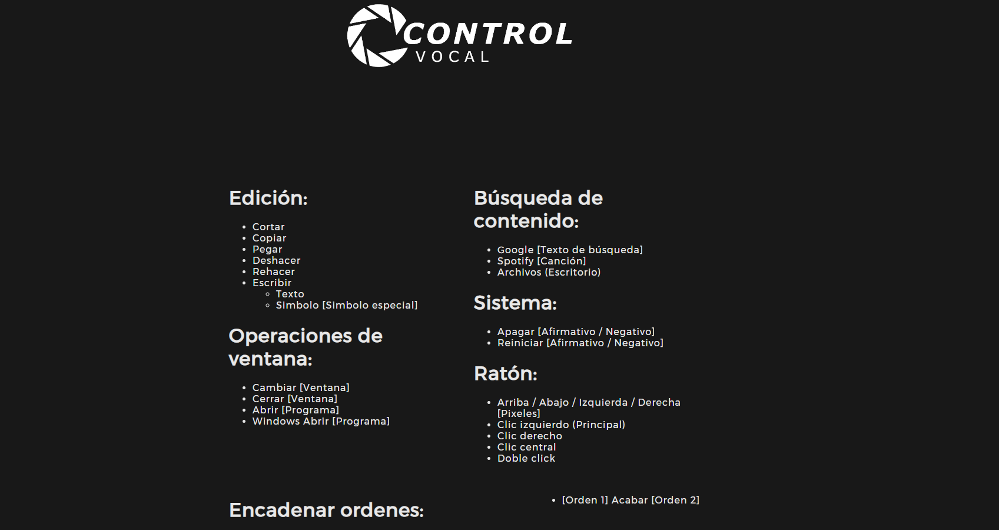

# Voice Controller Software for Windows

# Table of Contents
   * [What is this?](#what-is-this)
   * [Requirements](#requirements)
   * [Installation](#installation)
   * [How does it work?](#how-does-it-work)
      * [Google Cloud Architecture](#google-cloud-architecture)
      * [GUI](#gui)
      * [Voice Commands](#voice-commands)
   * [Video](#video)
   * [Authors](#authors)

## What is this?
Control Vocal is a versatile tool designed to help people with disabilities use a Windows PC entirely through voice commands in spanish. By leveraging Google Cloud Functions and Google Cloud Storage, this software enables users to perform a wide range of actions hands-free. Whether it's searching the web, writing in Microsoft Word, switching between windows, or playing music on Spotify, this assistant enhances accessibility and provides a seamless, intuitive user experience for those who rely on voice commands to navigate their computer.

## Requirements
For running this code, you need to install these languages and libraries:

- [Python 3.12.x](https://www.python.org/)
- [eel](https://pypi.org/project/eel/)
- [pyaudio](https://pypi.org/project/PyAudio/)
- [wave](https://docs.python.org/3/library/wave.html)
- [os](https://docs.python.org/3/library/os.html)
- [time](https://docs.python.org/3/library/time.html)
- [pyautogui](https://pyautogui.readthedocs.io/en/latest/)
- [json](https://docs.python.org/3/library/json.html)
- [pygetwindow](https://pypi.org/project/pygetwindow/)
- [difflib](https://docs.python.org/3/library/difflib.html)
- [webbrowser](https://docs.python.org/3/library/webbrowser.html)
- [subprocess](https://docs.python.org/3/library/subprocess.html)
- [keyboard](https://pypi.org/project/keyboard/)
- [psutil](https://psutil.readthedocs.io/en/latest/)
- [google-cloud-storage](https://pypi.org/project/google-cloud-storage/)
- [google-cloud-speech](https://pypi.org/project/google-cloud-speech/)

#### For Google Cloud:
- [functions-framework](https://pypi.org/project/functions-framework/) version 3.*
- [google-cloud-storage](https://pypi.org/project/google-cloud-storage/)
- [google-cloud-speech](https://pypi.org/project/google-cloud-speech/)

## Installation
To set up Control Vocal, follow these steps:
1. Clone the repository to your local machine.
2. Install the required libraries (check requirements.txt).
3. Create the Google Cloud Storage buckets (audio-script-sm and input-audio-uab).
4. Deploy the Google Cloud Function with the code from the cloud_functions folder.
5. Generate a service account key.
6. Execute the window.py file.
7. (Optional) If a Graphical User Interface is not required, execute the main.py

## How does it work?

1. The user starts the program.
2. The interface displays all the available commands and prompts the user to press the Ctrl key to execute them.
3. While the Ctrl key is held down, the graphical interface shows a message indicating that audio is being recorded.
4. Once the recording is complete, the audio file is sent to a cloud bucket named `input-audio-uab`.
5. When the audio reaches the bucket, a cloud function is triggered to convert the audio to text using speech-to-text technology.
6. After the text is generated, the instructions are separated and saved in another bucket named `audio-script-sm`.
7. The local program downloads and deletes the text file from the output bucket with the instructions and performs the following actions:
   - 7.1. Displays the text obtained from the audio on the graphical interface.
   - 7.2. Executes the various instructions requested by the user.
8. If the user has requested to shut down the computer, a confirmation message will be displayed on the screen, waiting for the user to confirm or cancel the decision.
9. Once the instructions have been executed, the process returns to step 2.

### Google Cloud Architecture

### GUI
The Graphical User Interface of the application is created using the Eel library, which combines HTML, CSS, and JavaScript for the front end with Python for the backend. Eel runs a local web server that serves the web-based interface, allowing for a rich, interactive user experience. JavaScript in the web interface communicates with Python functions, enabling dynamic interactions and data handling. This setup leverages the flexibility of web technologies while utilizing Python’s backend capabilities.

### Voice Commands

- **Cortar**: Cuts the selected item. (`Ctrl + X`)
- **Copiar**: Copies the selected item. (`Ctrl + C`)
- **Pegar**: Pastes from the clipboard. (`Ctrl + V`)
- **Deshacer**: Undoes the last action. (`Ctrl + Z`)
- **Rehacer**: Redoes the last undone action. (`Ctrl + Y`)
- **Escribir + "Texto"**: Types everything you say until you say "acabar escribir." To type symbols, you need to say "simbolo" followed by the ASCII number of the symbol and then "simbolo"
- **Cambiar [Window]**: Switches to the specified window.
- **Cerrar [Window]**: Closes the specified window.
- **Abrir [Program]**: Opens the specified program.
- **Windows Abrir [Program]**: Opens the specified program through the Windows Start menu. 
- **Google [Search Text]**: Searches for the specified text on Google.
- **Spotify [Song]**: Plays the specified song on Spotify.
- **Archivos (Escritorio)**: Opens the Files window to the Desktop directory. You can also use this command to access any file or folder located on the Desktop.
- **Apagar [Afirmativo / Negativo]**: Shuts down the computer. Say "Afirmativo" to confirm and "Negativo" to cancel.
- **Reiniciar [Afirmativo / Negativo]**: Restarts the computer. Say "Afirmativo" to confirm and "Negativo" to cancel.
- **Ratón: Arriba / Abajo / Izquierda / Derecha [Pixels]**: Moves the mouse cursor by the specified number of pixels in the given direction.
- **Clic izquierdo (Principal)**: Performs a left-click (primary click) with the mouse.
- **Clic derecho**: Performs a right-click with the mouse.
- **Clic central**: Performs a middle-click (usually the scroll wheel click) with the mouse.
- **Doble click**: Performs a double-click with the mouse.
- **[Command 1] Acabar [Command 2]**: For all instructions that require additional text (except for typing), say "Acabar" at the end to finalize the command. For example, to perform a Google search for the number of inhabitants in Spain, say: "Google Habitantes Espanya Acabar."

## Video
[Example Video](assets/example_video.mp4)

## Authors

- Guillem Cadevall Ferreres
- Jordi Herrera Valdivia
- Marc Serrano Sanz
- Òscar Urenda Moix
